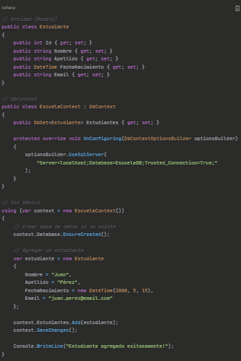
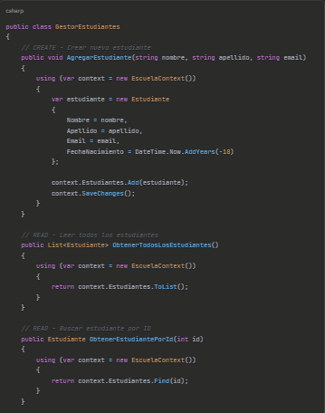
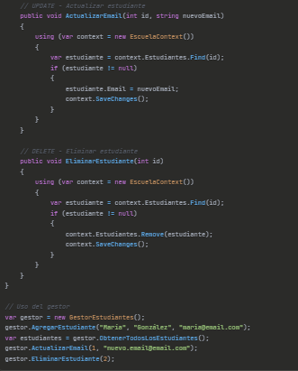
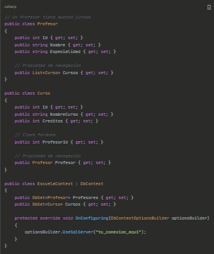
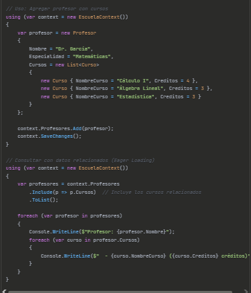
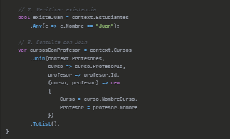
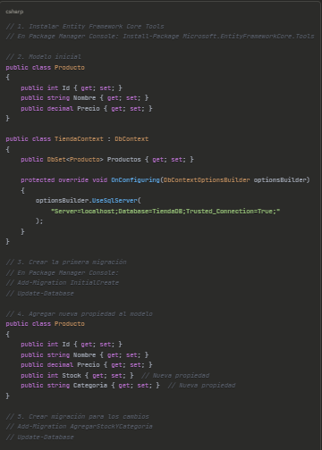
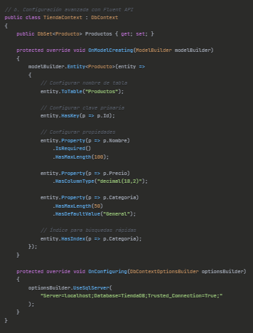
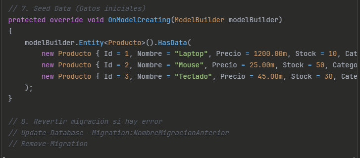

# Entity Framework - Presentación Completa

### ÍNDICE DE LA PRESENTACIÓN

¿Qué es Entity Framework?

Arquitectura y Componentes Principales

Enfoques de Desarrollo (Code First, Database First, Model First)

DbContext y DbSet

LINQ y Cons

ultas

Migraciones

Relaciones entre Entidades

Ventajas y Desventajas

Entity Framework vs Entity Framework Core

5 Ejemplos Prácticos

### 1. ¿QUÉ ES ENTITY FRAMEWORK?

Entity Framework (EF) es un ORM (Object-Relational Mapper) desarrollado por Microsoft para .NET. Permite a los desarrolladores trabajar con bases de datos usando objetos de C# en lugar de escribir consultas SQL directamente.
Concepto clave: Traduce objetos de tu código a tablas en la base de datos y viceversa.

### 2. ARQUITECTURA Y COMPONENTES PRINCIPALES

• EDM (Entity Data Model): Modelo conceptual que representa tus entidades

• LINQ Provider: Convierte consultas LINQ a SQL

• ADO.NET Provider: Se comunica con la base de datos

• DbContext: Punto de acceso principal a la base de datos

• DbSet: Representa una tabla o colección de entidades

### 3. ENFOQUES DE DESARROLLO
#### Code First

• Escribes clases en C# primero

• EF genera la base de datos automáticamente

• Ideal para proyectos nuevos

#### Database First

• Ya tienes una base de datos existente

• EF genera las clases automáticamente

• Útil para sistemas legacy

#### Model First

• Diseñas el modelo visualmente

• EF genera tanto la BD como las clases

• Menos común actualmente

### 4. DbContext y DbSet
DbContext: Clase que gestiona la conexión con la base de datos y el seguimiento de cambios.

DbSet<T>: Representa una tabla específica y permite realizar operaciones CRUD.

### 5. LINQ Y CONSULTAS
Entity Framework utiliza LINQ (Language Integrated Query) para realizar consultas de forma intuitiva en C#, sin necesidad de escribir SQL.

### 6. MIGRACIONES

Las migraciones permiten evolucionar la base de datos conforme cambian tus modelos. Cada cambio se registra como una migración que se puede aplicar o revertir.

### 7. RELACIONES ENTRE ENTIDADES

• Uno a Uno (1:1)

• Uno a Muchos (1:N)

• Muchos a Muchos (N:M)

• EF maneja estas relaciones mediante propiedades de navegación y claves foráneas.

### 8. VENTAJAS Y DESVENTAJAS
#### Ventajas:

• Reduce código SQL repetitivo

• Mantenimiento más fácil

• Tipado fuerte y IntelliSense

• Migraciones automáticas

• Abstracción de la base de datos

#### Desventajas:

• Curva de aprendizaje inicial

• Puede ser más lento que SQL optimizado

• Consultas complejas pueden ser difíciles

• Overhead de memoria

### 9. ENTITY FRAMEWORK VS ENTITY FRAMEWORK CORE

• EF Core: Versión moderna, multiplataforma, más ligera

• EF (tradicional): Solo Windows, más características legacy

• Recomendación actual: Usar EF Core para proyectos nuevos

## 10. CINCO EJEMPLOS PRÁCTICOS
EJEMPLO 1: Configuración Básica y Primera Entidad

EJEMPLO 2: Operaciones CRUD Completas

EJEMPLO 3: Relaciones Uno a Muchos (1:N)

EJEMPLO 4: Consultas LINQ Avanzadas

EJEMPLO 5: Migraciones y Code First

