# MODELOS Y DTOs: CONCEPTOS Y DIFERENCIAS
## ÍNDICE

### Introducción
• ¿Qué son los Modelos?

• ¿Qué son los DTOs?

• Diferencias Clave entre Modelos y DTOs

• ¿Cuándo usar cada uno?

• Ejemplos Prácticos (5 casos)

• Ventajas y Desventajas

### 1. INTRODUCCIÓN
En el desarrollo de aplicaciones modernas, es fundamental organizar correctamente la información que fluye entre las diferentes capas de nuestra aplicación. Dos conceptos esenciales para lograr esto son los Modelos y los DTOs (Data Transfer Objects).

### 2. ¿QUÉ SON LOS MODELOS?
Los Modelos son representaciones de las entidades del dominio de negocio que reflejan la estructura de la base de datos.

#### Características:

• Representan tablas de la base de datos

•Contienen lógica de negocio

• Incluyen relaciones entre entidades

• Tienen validaciones de integridad de datos

• Pueden incluir métodos y comportamientos

• Se utilizan en la capa de persistencia

#### Propósito:
Representar fielmente la estructura y reglas del negocio en el código.

### 3. ¿QUÉ SON LOS DTOs?
Los DTOs (Data Transfer Objects) son objetos simples diseñados exclusivamente para transferir datos entre diferentes capas o sistemas.

Características:

Son objetos planos (POJOs/POCOs)

No contienen lógica de negocio

Solo tienen propiedades y getters/setters

Diseñados para la comunicación

Pueden combinar datos de múltiples modelos

Se utilizan en APIs y servicios

Propósito:
Transportar datos de manera eficiente y segura, exponiendo solo la información necesaria.

### 4. DIFERENCIAS CLAVE

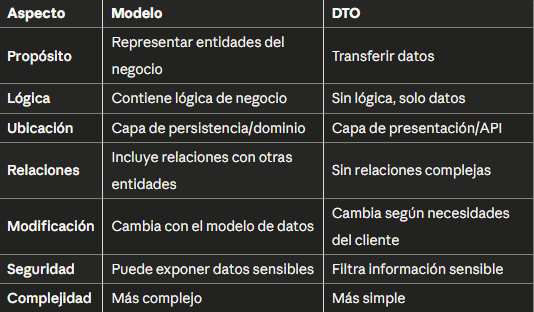

### 5. ¿CUÁNDO USAR CADA UNO?

#### Usar MODELOS cuando:

Trabajas dentro de la lógica de negocio
Realizas operaciones en la base de datos
Necesitas aplicar reglas de validación complejas
Trabajas en las capas internas de la aplicación

#### Usar DTOs cuando:

Expones datos a través de una API REST
Necesitas combinar información de varios modelos
Quieres ocultar información sensible
Trabajas con sistemas externos
Necesitas versionar tu API

### 6. EJEMPLOS PRÁCTICOS
EJEMPLO 1: Sistema de E-commerce - Usuario

Modelo (User):

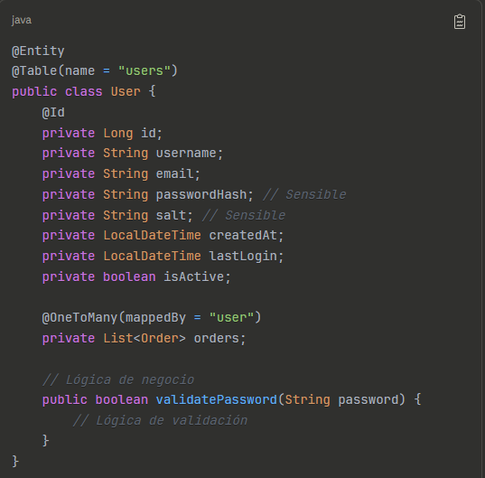

DTO (UserResponseDTO):

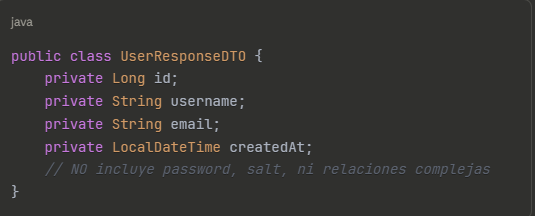

>¿Por qué separar? El modelo contiene información sensible (password, salt) que nunca debe exponerse en la API.

EJEMPLO 2: Sistema de Blog - Artículo

Modelo (Article):

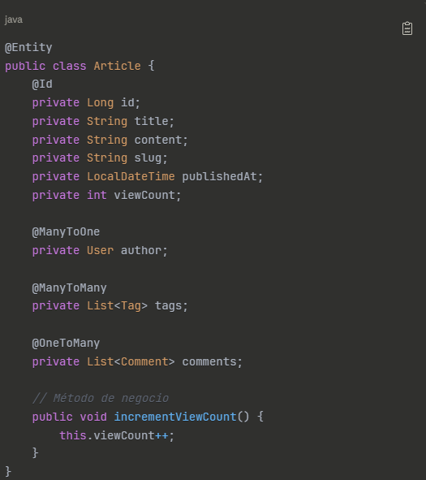

DTO (ArticleListDTO):

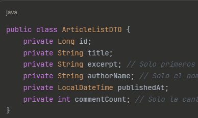

>¿Por qué separar? Para listar artículos no necesitamos el contenido completo ni cargar todos los comentarios, optimizando el rendimiento.

EJEMPLO 3: Sistema Bancario - Cuenta
Modelo (Account):

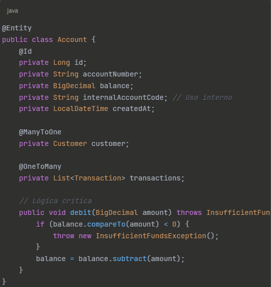

DTO (AccountBalanceDTO):

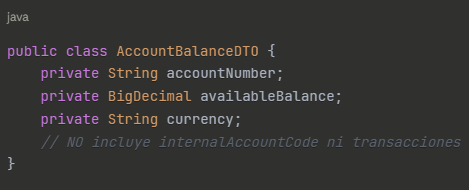

> ¿Por qué separar? Por seguridad, no exponemos códigos internos ni datos sensibles del cliente.

EJEMPLO 4: Red Social - Perfil de Usuario
Modelo (UserProfile):

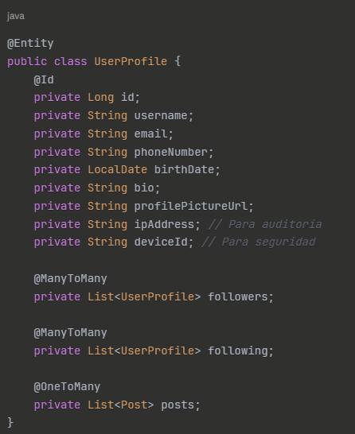

DTO (PublicProfileDTO):

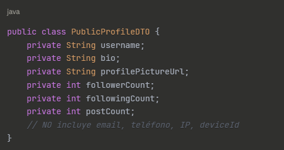

>¿Por qué separar? Protegemos la privacidad del usuario exponiendo solo información pública.

EJEMPLO 5: Sistema de Pedidos - Orden de Compra
Modelo (Order):

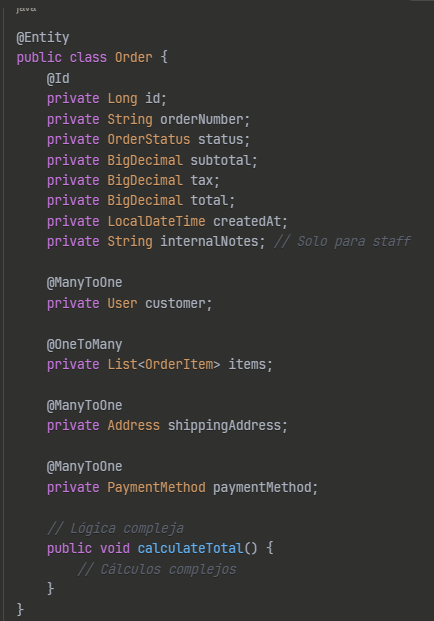

DTO (OrderSummaryDTO):

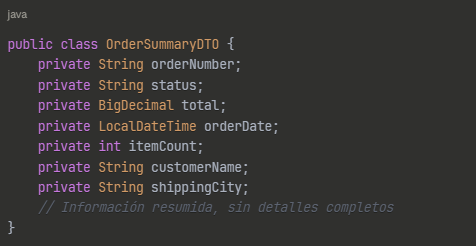
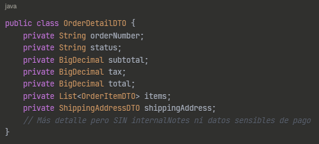

>¿Por qué separar? Tenemos diferentes necesidades: un resumen para listar órdenes y detalles completos para ver una orden específica.

### 7. VENTAJAS Y DESVENTAJAS

#### Ventajas de usar DTOs:

✅ Seguridad: Ocultan información sensible

✅ Flexibilidad: Múltiples DTOs para un mismo modelo

✅ Rendimiento: Transfieren solo datos necesarios

✅ Desacoplamiento: La API no depende del modelo de BD

✅ Versionado: Facilitan mantener versiones de API

✅ Validación específica: Validaciones según el contexto

#### Desventajas:
❌ Código adicional: Más clases que mantener

❌ Mapeo: Necesitas convertir entre Modelo y DTO

❌ Complejidad inicial: Mayor esfuerzo de configuración