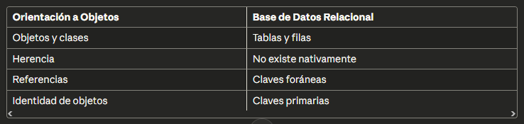
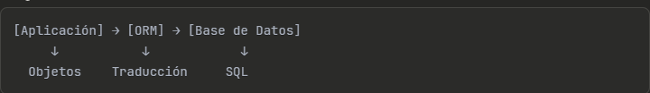
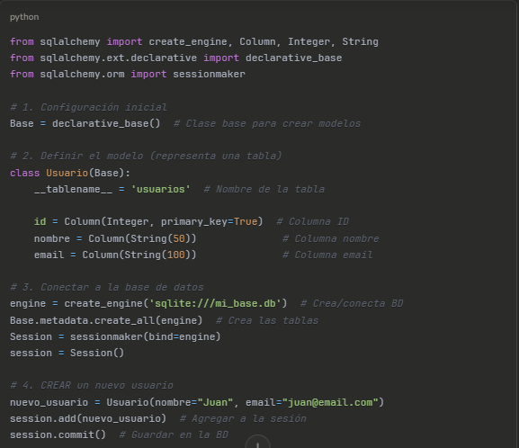
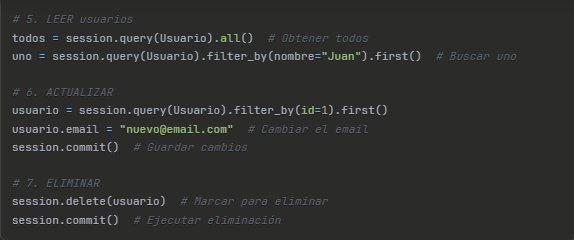
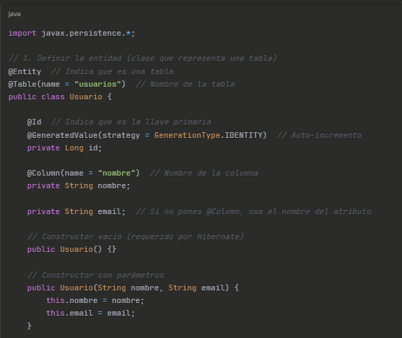
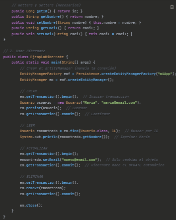
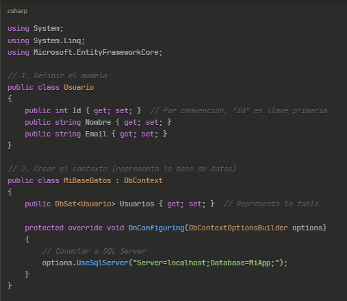
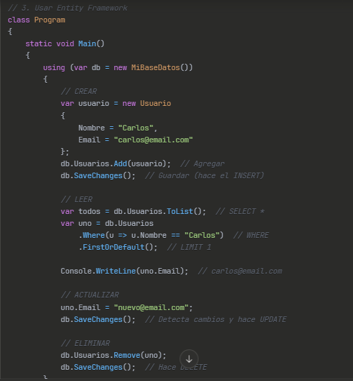
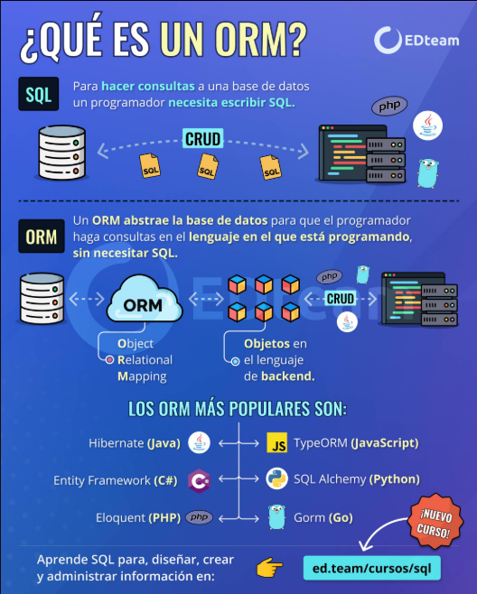

# ORM - Object-Relational Mapping (Mapeo Objeto-Relacional)

### 1. INTRODUCCIÓN

1.1 ¿Qué es ORM?

1.2 Historia y origen

1.3 ¿Por qué surge ORM?

### 2. EL PROBLEMA: IMPEDANCIA OBJETO-RELACIONAL

2.1 Diferencias entre POO y Bases de Datos Relacionales

2.2 Desafíos de la integración tradicional

### 3. ¿CÓMO FUNCIONA UN ORM?

3.1 Arquitectura básica

3.2 Proceso de mapeo

3.3 Componentes principales

### 4. CARACTERÍSTICAS PRINCIPALES

4.1 Mapeo de entidades

4.2 CRUD automatizado

4.3 Relaciones entre tablas

4.4 Migraciones de base de datos

4.5 Query Builder

### 5. VENTAJAS Y DESVENTAJAS

5.1 Ventajas

5.2 Desventajas

5.3 ¿Cuándo usar ORM?

### 6. EJEMPLOS DE ORM POPULARES

Ejemplo 1: SQLAlchemy (Python)

Ejemplo 2: Hibernate (Java)

Ejemplo 3: Entity Framework (C#)

Ejemplo 4: Sequelize (Node.js)

Ejemplo 5: Eloquent (PHP/Laravel)

Ejemplo 6: Prisma (Node.js/TypeScript)

### 7. CONCLUSIONES

7.1 Resumen

7.2 Recomendaciones

## 1. INTRODUCCIÓN
### 1.1 ¿Qué es ORM?

ORM (Object-Relational Mapping) es una técnica que actúa como puente entre la programación orientada a objetos y las bases de datos relacionales.

### 1.2 Historia

Surgió en los años 90
Respuesta a la necesidad de simplificar la interacción con bases de datos
Primera implementación significativa: TopLink (1994)

### 1.3 ¿Por qué surge?

Los desarrolladores necesitaban una forma más natural de trabajar con datos sin abandonar el paradigma orientado a objetos.

## 2. EL PROBLEMA: IMPEDANCIA OBJETO-RELACIONAL
Diferencias clave:

## 3. ¿CÓMO FUNCIONA UN ORM?

#### Proceso:

1. Defines modelos/clases en tu código

2. El ORM mapea estas clases a tablas

3. Llamas métodos en objetos

4. El ORM genera y ejecuta SQL automáticamente

## 4. CARACTERÍSTICAS PRINCIPALES

### 4.1 Mapeo de Entidades
Cada clase representa una tabla.
### 4.2 CRUD Automatizado
Create, Read, Update, Delete sin escribir SQL.

### 4.3 Relaciones

-Uno a Uno (1:1)

-Uno a Muchos (1:N)

-Muchos a Muchos (N:M)

## 5. VENTAJAS Y DESVENTAJAS
### Ventajas:

✅ Productividad aumentada

✅ Código más mantenible

✅ Abstracción de la base de datos

✅ Seguridad (prevención de SQL injection)

✅ Validaciones automáticas

### Desventajas:

❌ Curva de aprendizaje

❌ Overhead de rendimiento

❌ Consultas complejas pueden ser difíciles

❌ Debugging más complicado

## 6. EJEMPLOS DETALLADOS DE ORM

### EJEMPLO 1: SQLAlchemy (Python)
¿Qué hace? Permite trabajar con bases de datos en Python usando objetos.

#### Explicación:

> Sin ORM: Escribirías INSERT INTO usuarios (nombre, email) VALUES ('Juan', 'juan@email.com')

> Con ORM: Solo creas un objeto Usuario y llamas session.add() - ¡más simple!

## EJEMPLO 2: Hibernate (Java)
¿Qué hace? El ORM más popular para Java, integrado con Spring.

#### Explicación:

>@Entity: Le dice a Hibernate "esta clase es una tabla"

>@Id: Define la columna que es la llave primaria

>persist(): Equivale a INSERT

>find(): Equivale a SELECT WHERE id = ?

>Solo modificas el objeto y Hibernate genera el UPDATE automáticamente

## EJEMPLO 3: Entity Framework (C#)
¿Qué hace? ORM oficial de Microsoft para .NET.

## 7. CONCLUSIONES
✅ ORM simplifica el desarrollo reduciendo código repetitivo

✅ Aumenta la productividad pero requiere comprensión profunda

✅ No es una solución universal: consultas muy complejas pueden requerir SQL directo

✅ Elección del ORM depende del lenguaje y necesidades del proyecto

